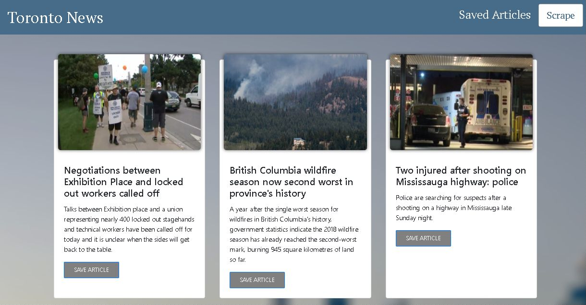
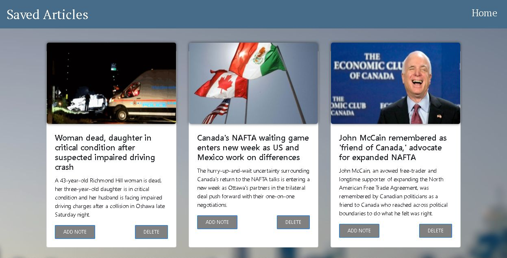
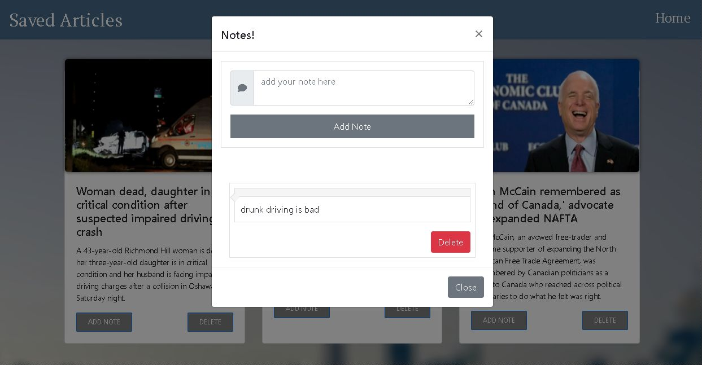

## News Scraping with MongoDB
This project utilizes MongoDB (noSQL) to store articles scraped from the CP24 news website. The application draws information from the website when the user chooses to 'scrape' articles and then stores them in a database.

## Motivation
This application is designed such that one can access information from a website without having to use an API. This is especially useful if one is looking to gather/display/store information from a website that does not have an external API. 

## Code style
This project was desinged within the MVC paradigm of application architecture. Doing so allows for separating distinct elements of one's application, making it more maintainable and easier to read. 
 
## Screenshots
  

  

  

## Technology Used

<b>Built with</b>
- [Node.js](https://nodejs.org/en/)
- [MongoDB](https://www.mongodb.com/)
- [Cheerio](https://www.npmjs.com/package/cheerio)
- [Mongoose](https://www.npmjs.com/package/mongoose)
- [Electron](https://electron.atom.io)

## Features
The defining aspect of this project is easy access to a news outlet. Users can quickly view the latest articles related to news in Toronto, save the ones they like, and read comments on the article. If they wish to visit the full article, the heading image of article is a direct link.

## Installation
If you want torun this on your local machine, here is what you do: 

1. Make sure you have Node.js and a Mongo server running (links provided above)
2. Clone the repository to your local machine
   * Install all modules (command will vary based on package        manager)
   * Create a .env file and add the password to your personal       Mongo database  
3. Run the server.js file
4. Hit 'localhost:8080' in your browser, and your ready to go!

## Problems
One issue I ran into during development was ensuring articles were not saved multiple times from separatae scraping occurrences. After looking through the MongoDb documentation, I discovered model properties can have a 'unique' value, which means documents in that model cannot be duplicated. Furthermore, one can add the 'dropDups' property to the model to ensure no duplicate values are created. 

## Live Look
[Node/Mongo Scraper](https://newsmongoscrape.herokuapp.com/savedArticles)
